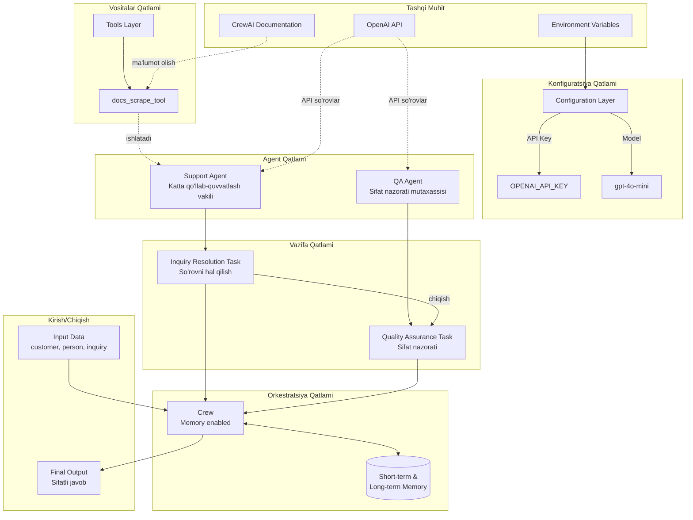
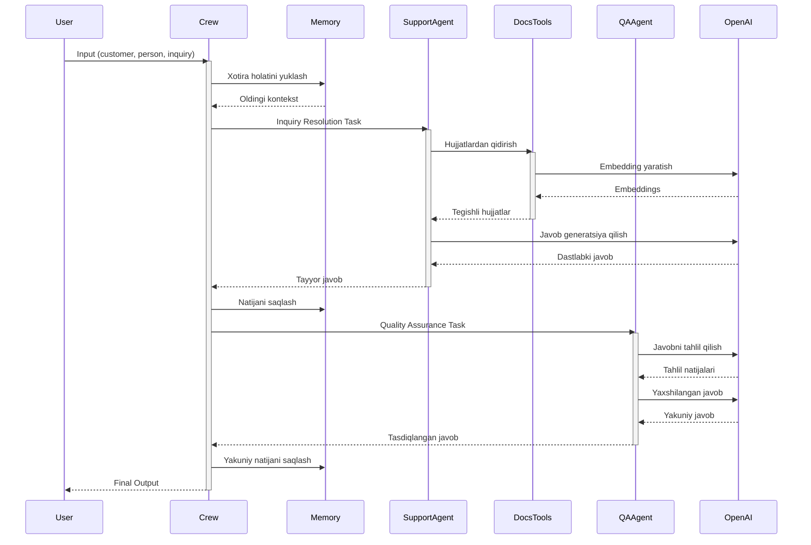
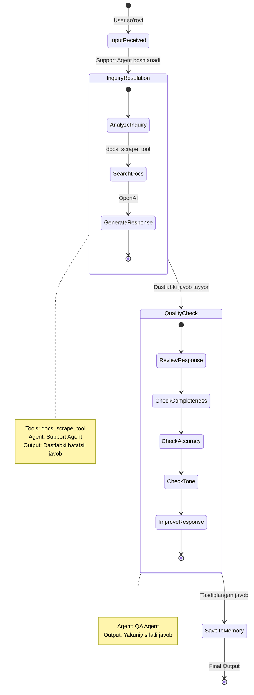
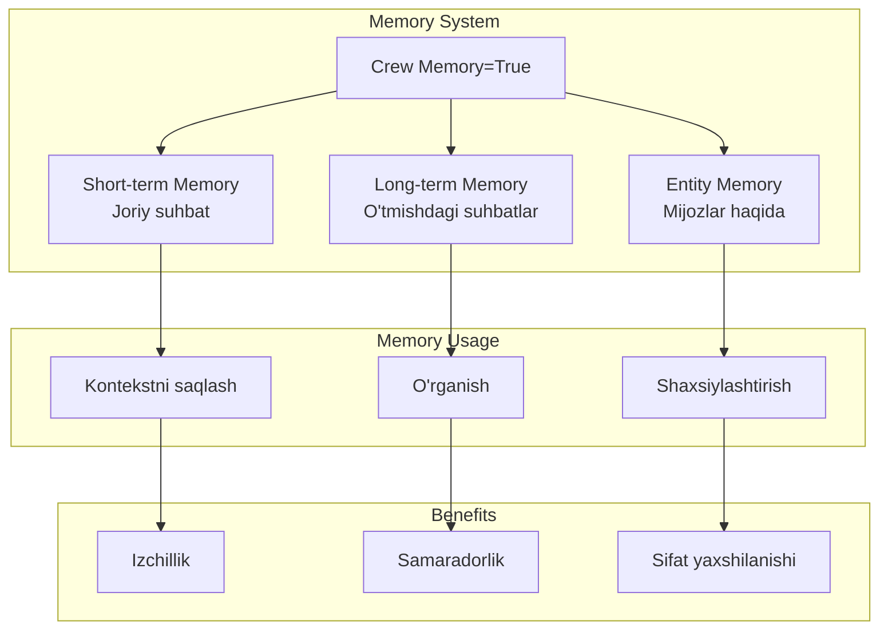
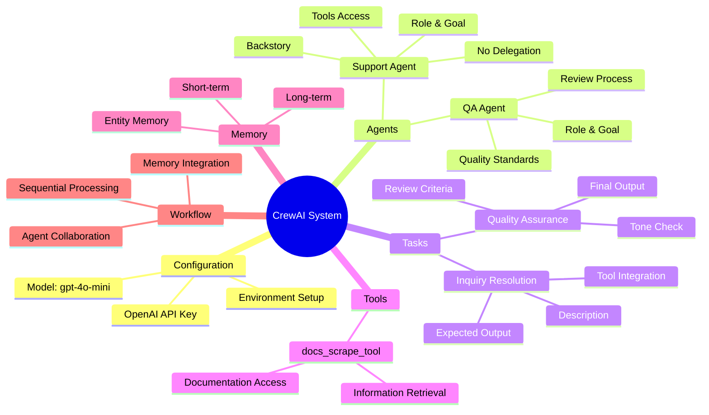
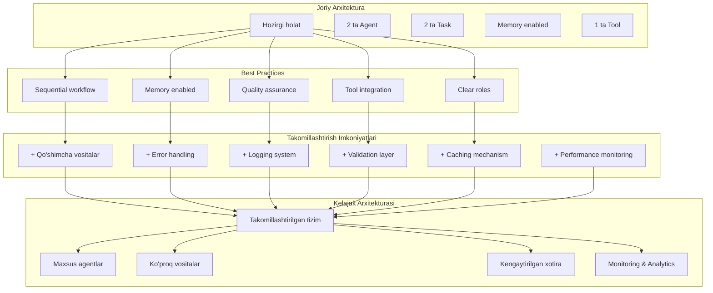

# CrewAI Qo'llab-quvvatlash Tizimi Arxitekturasi

## 1. Umumiy Tizim Arxitekturasi

---

## 2. Ma'lumotlar Oqimi (Data Flow)

---

## 3. Agent Arxitekturasi

```mermaid
graph LR
    subgraph "Support Agent"
        SA_ROLE[Role: Katta qo'llab-quvvatlash vakili]
        SA_GOAL[Goal: Eng do'stona yordam]
        SA_BACKSTORY[Backstory: CrewAI xodimi]
        SA_TOOLS[Tools: docs_scrape_tool]
        SA_CONFIG[Config: allow_delegation=False]
        
        SA_ROLE --> SA_GOAL
        SA_GOAL --> SA_BACKSTORY
        SA_BACKSTORY --> SA_TOOLS
        SA_TOOLS --> SA_CONFIG
    end

    subgraph "QA Agent"
        QA_ROLE[Role: Sifat nazorati mutaxassisi]
        QA_GOAL[Goal: Eng yaxshi sifatni ta'minlash]
        QA_BACKSTORY[Backstory: Sifat tekshiruvchi]
        QA_CONFIG[Config: default settings]
        
        QA_ROLE --> QA_GOAL
        QA_GOAL --> QA_BACKSTORY
        QA_BACKSTORY --> QA_CONFIG
    end

    SA_CONFIG -.->|Chiqish| QA_ROLE
```

---

## 4. Task Workflow

---

## 5. Memory Tizimi

---

## 6. Komponentlar Bog'lanishi

---

## 7. Best Practices va Takomillashtirish

---

## Asosiy Xususiyatlar

### 1. **Qatlamli Arxitektura**
- Configuration Layer: Muhit sozlamalari
- Tools Layer: Yordamchi vositalar
- Agent Layer: Aqlli agentlar
- Task Layer: Vazifalar
- Orchestration Layer: Crew boshqaruvi

### 2. **Agent Specialization**
- **Support Agent**: Mijoz so'rovlarini hal qilish
- **QA Agent**: Sifatni ta'minlash

### 3. **Memory Integration**
- Short-term memory: Joriy kontekst
- Long-term memory: Tarixiy ma'lumotlar
- Entity memory: Mijozlar haqida bilim

### 4. **Quality Assurance**
- Ikki bosqichli tekshiruv
- Sifat standartlari
- Professional ohang

### 5. **Tool Integration**
- docs_scrape_tool: Hujjatlardan qidirish
- Kengaytiriladigan arxitektura
